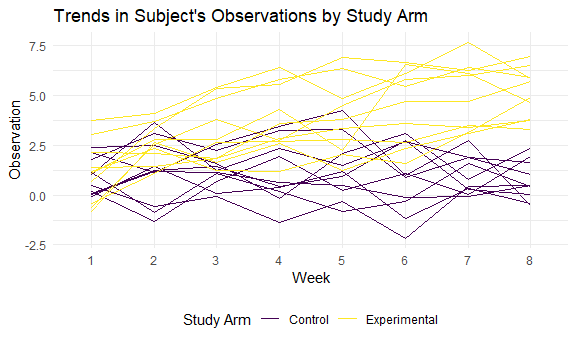

P8105 Homework 5
================
sarah\_8105

This is my fifth homework assignment for P8105.

``` r
library(tidyverse)
```

    ## -- Attaching packages ----------------------------------------------------------------------------------------------------------- tidyverse 1.3.0 --

    ## v ggplot2 3.3.2     v purrr   0.3.4
    ## v tibble  3.0.4     v dplyr   1.0.2
    ## v tidyr   1.1.2     v stringr 1.4.0
    ## v readr   1.3.1     v forcats 0.5.0

    ## Warning: package 'tibble' was built under R version 4.0.3

    ## Warning: package 'purrr' was built under R version 4.0.3

    ## -- Conflicts -------------------------------------------------------------------------------------------------------------- tidyverse_conflicts() --
    ## x dplyr::filter() masks stats::filter()
    ## x dplyr::lag()    masks stats::lag()

``` r
library(rvest)
```

    ## Loading required package: xml2

    ## 
    ## Attaching package: 'rvest'

    ## The following object is masked from 'package:purrr':
    ## 
    ##     pluck

    ## The following object is masked from 'package:readr':
    ## 
    ##     guess_encoding

``` r
library(readr)

knitr::opts_chunk$set(
  fig.width = 6,
  fig.asp = .6,
  out.width = "90%"
)

theme_set(theme_minimal() + theme(legend.position = "bottom"))

options(
  ggplot2.continuous.colour = "viridis",
  ggplot2.continuous.fill = "viridis"
)

scale_colour_discrete = scale_colour_viridis_d
scale_fill_discrete = scale_fill_viridis_d
```

## Problem 2

Problem 2 concerns data from a longitudinal study that includes a
control and experimental study arms. In the following code chunk, I
import data on each study participant that have been stored as separate
csv files. I create an `import_csv` function that is used to import and
clean each csv file and iterate over all csv file using `purrr::map`. I
also create variables representing the study arm and study ID of each
participant. Since study ID is duplicated over the study arms and is
therefore not unique, I also create a `unique_id` variable that can be
used to identify each participant.

``` r
p2_df = tibble(file_name = list.files(path = "./data/"))

import_csv = function(file) {
  read_csv(file) %>%
  janitor::clean_names() %>%
    pivot_longer(
      week_1:week_8,
      names_to = "week",
      names_prefix = "week_",
      values_to = "observation"
    )
}

p2_df = p2_df %>%
  mutate(
    unique_id = seq.int(nrow(p2_df)),
    study_id = str_sub(file_name, 5, 6),
    study_arm = ifelse(str_detect(file_name, "con"), "Control", "Experimental"),
    data = map(str_c('./data/',file_name), import_csv),
    ) %>%
  select(-file_name) %>%
  unnest()
```

    ## Warning: `cols` is now required when using unnest().
    ## Please use `cols = c(data)`

In the following code chunk, I create a spaghetti plot that displays the
observations on each subject over time, color coded by study arm.

``` r
p2_df %>%
  ggplot(aes(x = week, y = observation, group = unique_id, color = study_arm)) +
  geom_line() +
  labs(
    title = "Trends in Subject's Observations by Study Arm",
    x = "Week",
    y = "Observation",
    color = "Study Arm"
  )
```



From this plot, you can see that study participants in the control arm
have a relatively constant level in the observation value over time
while study participants in the experimental arm generally increase in
the observation value over time.

## Problem 3

In the following code chunk, I create a simulation to explore the
effects of power on a simple linear regression. For this simulation, I
set the sample size to 30 and standard deviation to 5. I modify the
sample mean in 1-unit increments from 0 to 6, running 5,000 simulated
data sets per mean.

``` r
sim_mean_sd = function(n = 30, mu = 0, sigma = 5) {
  
  sim_data = tibble(
    x = rnorm(n, mean = mu, sd = sigma),
  )
  
  sim_data %>% 
    summarize(
      mu_hat = mean(x),
      sigma_hat = sd(x),
      p = broom::tidy(t.test(x))
    )
}

sim_results = 
  tibble(mu = c(0, 1, 2, 3, 4, 5, 6)) %>%
  mutate(
    output_lists = map(.x = mu, ~ rerun(5, sim_mean_sd(mu = .x))),
    estimate_dfs = map(output_lists, bind_rows)
    ) %>%
  select(-output_lists) %>%
  unnest(estimate_dfs)
```
