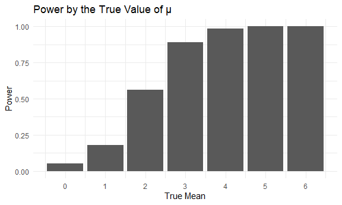

P8105 Homework 5
================
sarah\_8105

This is my fifth homework assignment for P8105.

``` r
library(tidyverse)
```

    ## -- Attaching packages --------------------- tidyverse 1.3.0 --

    ## v ggplot2 3.3.2     v purrr   0.3.4
    ## v tibble  3.0.4     v dplyr   1.0.2
    ## v tidyr   1.1.2     v stringr 1.4.0
    ## v readr   1.3.1     v forcats 0.5.0

    ## Warning: package 'tibble' was built under R version 4.0.3

    ## Warning: package 'purrr' was built under R version 4.0.3

    ## -- Conflicts ------------------------ tidyverse_conflicts() --
    ## x dplyr::filter() masks stats::filter()
    ## x dplyr::lag()    masks stats::lag()

``` r
library(rvest)
```

    ## Loading required package: xml2

    ## 
    ## Attaching package: 'rvest'

    ## The following object is masked from 'package:purrr':
    ## 
    ##     pluck

    ## The following object is masked from 'package:readr':
    ## 
    ##     guess_encoding

``` r
library(readr)
library(httr)
```

    ## Warning: package 'httr' was built under R version 4.0.3

``` r
knitr::opts_chunk$set(
  fig.width = 6,
  fig.asp = .6,
  out.width = "90%"
)

theme_set(theme_minimal() + theme(legend.position = "bottom"))

options(
  ggplot2.continuous.colour = "viridis",
  ggplot2.continuous.fill = "viridis"
)

scale_colour_discrete = scale_colour_viridis_d
scale_fill_discrete = scale_fill_viridis_d
```

## Problem 1

In this first code chunk, I pull the Washington Post data on homicides
in 50 large US cities. I create a `city_state` variable that concatenate
the city and state that the homicde occurred in and remove an
observation that was erroneously attributed to Tulsa, AL.

``` r
homicide_df = read_csv(file = "https://raw.githubusercontent.com/washingtonpost/data-homicides/master/homicide-data.csv") %>%
  mutate(
    city_state = str_c(city, state, sep = "_")
  ) %>%
  select(city_state, disposition) %>%
  filter(city_state != "Tulsa_AL")
```

    ## Parsed with column specification:
    ## cols(
    ##   uid = col_character(),
    ##   reported_date = col_double(),
    ##   victim_last = col_character(),
    ##   victim_first = col_character(),
    ##   victim_race = col_character(),
    ##   victim_age = col_character(),
    ##   victim_sex = col_character(),
    ##   city = col_character(),
    ##   state = col_character(),
    ##   lat = col_double(),
    ##   lon = col_double(),
    ##   disposition = col_character()
    ## )

In the next code chunk, I aggregate the homicide data to the city level
and two variables that represent the total number of homicides
(`tot_hom`) and the number of unsolved homicides (`unsolve_hom`) in each
respective city. I also use the `prop.test` function to estimate the
proportion of homicides that are unsolved in Baltimore, MD.

``` r
homicide_summary =
  homicide_df %>%
  group_by(city_state) %>%
  summarize(
    tot_hom = n(),
    unsolv_hom = sum(disposition %in% c("Closed without arrest", "Open/No arrest"))
  )
```

    ## `summarise()` ungrouping output (override with `.groups` argument)

``` r
prop.test(
  homicide_summary %>% filter(city_state == "Baltimore_MD") %>% pull(unsolv_hom),
  homicide_summary %>% filter(city_state == "Baltimore_MD") %>% pull(tot_hom)) %>%
  broom::tidy()
```

    ## # A tibble: 1 x 8
    ##   estimate statistic  p.value parameter conf.low conf.high method    alternative
    ##      <dbl>     <dbl>    <dbl>     <int>    <dbl>     <dbl> <chr>     <chr>      
    ## 1    0.646      239. 6.46e-54         1    0.628     0.663 1-sample~ two.sided

An estimated 64.6% of homicides in Baltimore are unsolved (95% CI:
62.8%-66.3%)

In the next code chunk, I write a function that iterates over all cities
within the data to calculate the estimated proportion of homicides that
are unsolved and their 95% confidence intervals.

``` r
results_df = 
  homicide_summary %>%
  mutate(
    prop_tests = map2(.x = unsolv_hom, .y = tot_hom, ~prop.test(x = .x, n = .y)),
    tidy_tests = map(.x = prop_tests, ~broom::tidy(.x))
  ) %>%
  select(-prop_tests) %>%
  unnest(tidy_tests) %>%
  select(city_state, estimate, conf.low, conf.high)
```

Finally, I plot the results from this function.

``` r
results_df %>%
  mutate(city_state = fct_reorder(city_state, estimate)) %>%
  ggplot(aes(x = city_state, y = estimate)) +
  geom_point() +
  geom_errorbar(aes(ymin = conf.low, ymax = conf.high)) +
  theme(axis.text.x = element_text(angle = 90, vjust = 0.5, hjust = 1)) +
  labs(
    title = "Estimated Proportion of Unsolved Homicides by City",
    x = "City",
    y = "Unsolved Homicides"
  )
```


From this graph, Richmond, VA has the lowest estimated proportion of
unsolved homicides at below 30% and Chicago, IL has the highest
proportion of unsolved homicides at above 70%.

## Problem 2

Problem 2 concerns data from a longitudinal study that includes control
and experimental study arms. In the following code chunk, I import data
on each study participant that have been stored as separate csv files. I
create an `import_csv` function that is used to import and clean each
csv file and iterate over all csv file using `purrr::map`. I also create
variables representing the study arm and study ID of each participant.
Since study ID is duplicated over the study arms and is therefore not
unique, I also create a `unique_id` variable that can be used to
identify each participant.

``` r
p2_df = 
  tibble(
    file_name = list.files(path = "./data/")
    )

import_csv = function(file) {
  read_csv(file) %>%
  janitor::clean_names() %>%
    pivot_longer(
      week_1:week_8,
      names_to = "week",
      names_prefix = "week_",
      values_to = "observation"
    )
}

p2_df = p2_df %>%
  mutate(
    unique_id = seq.int(nrow(p2_df)),
    study_id = str_sub(file_name, 5, 6),
    study_arm = ifelse(str_detect(file_name, "con"), "Control", "Experimental"),
    data = map(str_c('./data/',file_name), import_csv),
    ) %>%
  select(-file_name) %>%
  unnest()
```

    ## Warning: `cols` is now required when using unnest().
    ## Please use `cols = c(data)`

In the following code chunk, I create a spaghetti plot that displays the
observations on each subject over time, color coded by study arm.

``` r
p2_df %>%
  ggplot(aes(x = week, y = observation, group = unique_id, color = study_arm)) +
  geom_line() +
  labs(
    title = "Trends in Subject's Observations by Study Arm",
    x = "Week",
    y = "Observation",
    color = "Study Arm"
  )
```


From this plot, you can see that study participants in the control arm
have a relatively constant level in the observation value over time
while study participants in the experimental arm generally increase in
the observation value over time.

## Problem 3

In the following code chunk, I run a simulation to explore the effects
of power on a simple linear regression. For this simulation, I set the
sample size to 30 and standard deviation to 5. I modify the sample mean
in 1-unit increments from 0 to 6, running 5,000 simulated data sets per
mean.

``` r
sim_mean_sd = function(n = 30, mu = 0, sigma = 5) {
  
  sim_data = tibble(
    x = rnorm(n, mean = mu, sd = sigma),
  )
  
  sim_data %>% 
    summarize(
      broom::tidy(t.test(x), p.value)
    ) 
}

sim_results = 
  tibble(mu = c(0, 1, 2, 3, 4, 5, 6)) %>%
  mutate(
    output_lists = map(.x = mu, ~ rerun(5000, sim_mean_sd(mu = .x))),
    estimate_dfs = map(output_lists, bind_rows)
    ) %>%
  select(-output_lists) %>%
  unnest(estimate_dfs) %>%
  select(mu, estimate, p.value)
```

In the following code chunk, I plot the proportion of times the null was
rejected (at an α of 0.05) by the true value of μ.

``` r
sim_results_summary = sim_results %>%
  group_by(mu) %>%
  summarize(
    true_mean = mean(mu),
    avg_est_mean = mean(estimate),
    std_est_mean = sd(estimate),
    power = sum(p.value < .05)/n()
  ) %>%
  mutate(
    group = "All Samples"
  )
```

    ## `summarise()` ungrouping output (override with `.groups` argument)

``` r
sim_results_summary %>%
  ggplot(aes(x = true_mean, y = power)) +
  geom_bar(stat = "identity") +
  scale_x_continuous(
    breaks = c(0, 1, 2, 3, 4, 5, 6)
  ) +
  labs(
    title = "Power by the True Value of μ",
    x = "True Mean",
    y = "Power"
  ) 
```



As shown in this plot, power (or the proportion of times the null was
rejected) increases as the effect size increases.

In the following code chunk, I plot the average estimate of μ by the
true value of μ for the full simulation results and for the portion of
samples in which the null was rejected.

``` r
pd <- position_dodge(0.5) 

sim_results %>%
  filter(p.value < .05) %>%
  group_by(mu) %>%
  summarize(
    true_mean = mean(mu),
    avg_est_mean = mean(estimate),
    std_est_mean = sd(estimate)
  ) %>%
  mutate(
    group = "Samples where Null Rejected"
  ) %>%
  bind_rows(sim_results_summary) %>%
  ggplot(aes(x = true_mean, y = avg_est_mean, group = group, color = group)) +
    geom_errorbar(aes(ymin = avg_est_mean - std_est_mean, ymax = avg_est_mean + std_est_mean), position = pd, width = .2) +
    geom_point(size = 4, position = pd) +
  scale_x_continuous(
    breaks = c(0, 1, 2, 3, 4, 5, 6)
  ) +
  labs(
    title = "Average Estimate of μ by the True Value of μ",
    x = "True Mean",
    y = "Estimated Mean"
  )
```

    ## `summarise()` ungrouping output (override with `.groups` argument)


As shown in this plot, the sample average estimate of μ for which the
null is rejected is approximately equal to the true value of μ as the
effect size increases but is less equal to the true value of μ as the
effect size decreases. This occurs because the subset of samples in
which the null hypothesis is rejected will have an estimated μ further
away from 0. For samples with a true μ that is closer to 0, this subset
represents a smaller portion of samples that randomly have an average
estimated μ that is higher than the true μ. For samples with a true μ
that is further from 0, this subset represents the majority of samples.
